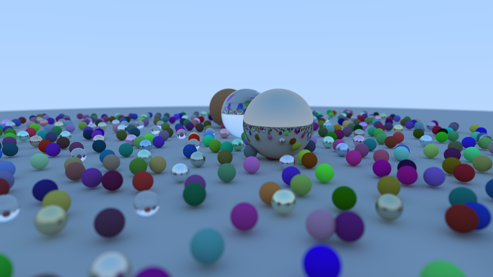

# Raytracer

A simple raytracer I wrote to learn the basic principles of the subject.

Almost all subject matter is inspired by, draws heavily from, or in the case of the gnarliest sections (I'm looking at you [Schlick](https://en.wikipedia.org/wiki/Schlick%27s_approximation)) is directly copied from the wonderful [_Ray Tracing in One Weekend_](https://raytracing.github.io/books/RayTracingInOneWeekend.html) and its [Rust translation](https://misterdanb.github.io/raytracinginrust/).

